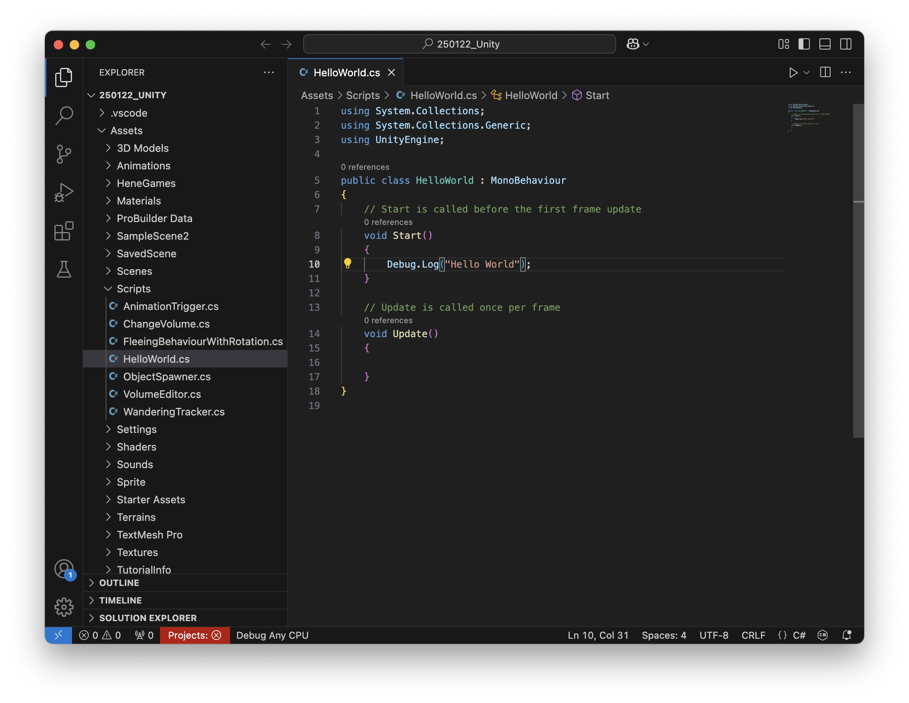

# <a name="Recording"></a>Recording 

##  Install Recorder
- In the top menu go to: Window → Package Manager
- In the Package Manager: Click the dropdown at the top left and select "Unity Registry". 
- Search for "Recorder".
- Select Unity Recorder from the list and click "Install".


## Record 
- Once installed, go to: Window → General → Recorder → Recorder Window
- The Recorder Window will open, where you can set up your recording.

- In the Recorder Window, click the “+ Add New Recorder” button. Choose the recording type: Movie: For standard video files (like MP4).

- Configure the Recording Settings like this: 


- If the resolution 4K is too much, so can set it to FHD - 1080p.
- Make sure that the movie file gets saved outside your Unity folder! 

- When you now click the Play Button Unity will record your scene. 

>You can also change the Recording Mode: 
>   - Manual: Start and stop recording manually.
>   - Frame Interval: Record from specific frames (e.g., frames 0–300).
>   - Time Interval: Record for a set time (e.g., 10 seconds).

> You can also find more detailled instruction how to use advanced camera movements here: [Unity Cinemachine Introduction](https://github.com/juliannetzer/wise2223_worldbuilding_unity/blob/main/session2.md#cinemachine)

# <a name="Coding"></a>Coding in Unity 

In Unity, scripts with the programming language C# are used to control the behavior of GameObjects. Scripts interact with objects by modifying their properties, responding to player input, or handling game logic. Each script is typically attached to a GameObject as a component, allowing it to influence that object.

A script is a asset saved as a .cs-File 

A basic Unity script looks like this:
```
using UnityEngine; //imports whats needed for the script to run, in this case the basic Unity Engine

public class ExampleScript : MonoBehaviour //Name of the Script (must be the same as the filename)
{
    void Start()
    {
        // Runs once when the GameObject is first activated
    }

    void Update()
    {
        // Runs every frame, useful for movement or checking inputs
    }
}
```

> when you write // in your code you can write comments afterwards, this is useful to explain this, or to remember what certain code blocks are for

## Functions

A function (also called a method) in Unity is a block of code that performs a specific task. Functions help organize code, making it reusable and easier to manage. In Unity, functions are often used to control GameObjects, handle player input, or execute game logic.
Structure of a Function

A function in C# consists of:
- Return Type – Defines what the function returns (e.g., void for no return, int for numbers).
- Function Name – The identifier used to call the function.
- Parameters (Optional) – Data passed into the function.
- Code Block – The actual instructions inside { }.

Example:
```
void Start()
    {
        Debug.Log("Hello World");// Runs once when the GameObject is first activated, this writes "Hello World" in the console.
    }
```

## Variables

Variables are like storage boxes that hold data (values).

- int – Stores whole numbers (e.g., int score = 10;).
- float – Stores decimal numbers (e.g., float speed = 5.5f;).
- bool – Stores true or false (e.g., bool isJumping = false;).
- string – Stores text (e.g., string playerName = "Alex";).
- GameObject / Transform / Rigidbody – Stores references to Unity objects.

## Control Structures 

### Conditionals

These allow the program to make decisions. 

Example:
```
if (health < 20) {
    Debug.Log("Warning: Low health!");
} else {
    Debug.Log("Health is good.");
}
```

## Examples how scripts interact with GameObjects

#### Access Components – Scripts can modify an object's Transform, Audio Source, Rigidbody, Collider, or any other component.
```
GetComponent<AudioSource>().volume = 0;
```

#### Modify Object Properties – Change position, scale, color, or any other attribute.
```
transform.position = new Vector3(0, 2, 0);
```
#### Handle Player Input – Detect key presses, mouse clicks, or controller inputs.
```
    if (Input.GetKeyDown(KeyCode.Space))
    {
        Debug.Log("Jump!");
    }
```

## <a name="newscript"></a>Creating a new script

To create a script select Assets -> Create -> C# Script and select a name (please use a name that describes the function in our case "PositionToColor"). 


Then double click on the script in the project window, this should open Visual Studio Code with the script opened: 


Now we can copy & paste our code: 
```
using UnityEngine;

public class PositionToColor : MonoBehaviour
{
    private Renderer rend;

    void Start()
    {
        rend = GetComponent<Renderer>();
    }

    void Update()
    {
        Vector3 p = transform.position;

        float r = Mathf.InverseLerp(-10f, 10f, p.x);
        float g = Mathf.InverseLerp(-10f, 10f, p.y);
        float b = Mathf.InverseLerp(-10f, 10f, p.z);

        rend.material.color = new Color(r, g, b);
    }
}
```

In Unity, a script needs to be attached to a GameObject to function properly because of how Unity’s architecture is designed. Unity follows a component-based architecture, where behaviors and properties are added to GameObjects through components—and scripts are one of those components.

So we will create an 3D cube called "ChangeColor", for this go to GameObject -> 3D Object -> Cube. Now position the cube at the position 0/0/0.

When we created the GameObject we can either drag and drop our script on the GameObject or we can select the GameObject and click on "Add Component" and search for our "PositionToColor"-Script. 

When you now press Play, you should see that the Cube Color changes according to its position.


## Public Variables & Unity Editor

For the next example we will use a more advanced script, that starts to play an audio file, when the player (or another GameObject) comes near. In this example we will also work with public variables. Variables declared as public can be edited directly in the Inspector without modifying the script. This makes tweaking values easier without needing to recompile the code. You can also make a public GameObject variable to edit other GameObjects in your scene. 

So again create a new C# script and name it "ProximitySoundTrigger", then copy and paste the following code:

Example Script: 

```
using UnityEngine;

[RequireComponent(typeof(AudioSource))]
[RequireComponent(typeof(SphereCollider))]
public class ProximitySoundTrigger : MonoBehaviour
{
    [Tooltip("Radius within which the sound will be triggered")]
    public float triggerRadius = 5f;
    
    private AudioSource audioSource;
    private SphereCollider triggerCollider;
    private bool hasPlayed = false;

    private void Awake()
    {
        // Get or add required components
        audioSource = GetComponent<AudioSource>();
        triggerCollider = GetComponent<SphereCollider>();
        
        // Configure the collider
        triggerCollider.isTrigger = true;
        triggerCollider.radius = triggerRadius;
        
        // Configure the audio source to not play on awake
        audioSource.playOnAwake = false;
    }

    private void OnValidate()
    {
        // Update collider radius when changed in inspector
        if (triggerCollider != null)
        {
            triggerCollider.radius = triggerRadius;
        }
    }

    private void OnTriggerEnter(Collider other)
    {
        // Play sound if it hasn't played yet
        if (!hasPlayed)
        {
            audioSource.Play();
            hasPlayed = true;
        }
    }

    private void OnTriggerExit(Collider other)
    {
        // Reset the played flag when object exits the trigger
        hasPlayed = false;
    }
}
```

Then again create a new GameObject in your scene and add the script. When you add the script it automatically adds a collider and an Audio Source to the GameObject. 
It also adds the possibilty to change the radius of the collider directly via the inspector: 


Then add a sound to the Audio source that gets played when the character (or another object with a collider) is near. 

> You can also find the script here: [link to script](Script/ProximitySoundTrigger.cs).
>  To import the script go to "Download raw file" and then drag and drop in your Unity project window. 

# <a name="llm"></a>Working with ChatGPT & Claude

In the next step we want to change our existing script with the LLMs (Large Language Models) ChatGPT (https://chatgpt.com) or Claude (https://claude.ai). 
So please first sign up for one of the tools.  

The first exercise it to change the script, that it does not play a Audio file but instead turns a light on. For this we can either ask the LLM directly for the script, or use the already existing script and ask it to change it. 

The prompt to generate the audio script was: 
```
Write a script for the GameEngine Unity 2022.3 that does the following:
* plays a sound when the player (or any GameObject with a collider) comes near, use a collider for this
* makes sure that the GameObject where the script is attached has every component needed for that 
* has a public variable to define the radius when the audio files gets played
```

And the resulting script was: 
```
using UnityEngine;

[RequireComponent(typeof(AudioSource))]
[RequireComponent(typeof(SphereCollider))]
public class ProximitySoundTrigger : MonoBehaviour
{
    [Tooltip("Radius within which the sound will be triggered")]
    public float triggerRadius = 5f;
    
    private AudioSource audioSource;
    private SphereCollider triggerCollider;
    private bool hasPlayed = false;

    private void Awake()
    {
        // Get or add required components
        audioSource = GetComponent<AudioSource>();
        triggerCollider = GetComponent<SphereCollider>();
        
        // Configure the collider
        triggerCollider.isTrigger = true;
        triggerCollider.radius = triggerRadius;
        
        // Configure the audio source to not play on awake
        audioSource.playOnAwake = false;
    }

    private void OnValidate()
    {
        // Update collider radius when changed in inspector
        if (triggerCollider != null)
        {
            triggerCollider.radius = triggerRadius;
        }
    }

    private void OnTriggerEnter(Collider other)
    {
        // Play sound if it hasn't played yet
        if (!hasPlayed)
        {
            audioSource.Play();
            hasPlayed = true;
        }
    }

    private void OnTriggerExit(Collider other)
    {
        // Reset the played flag when object exits the trigger
        hasPlayed = false;
    }
}
```

So either try to generate a script that turns on a light when the character comes near only with the LLM or ask the LLM to change the code based on the previous script. 

> You can also think of other things to happen, e.g.: 
> - the object get randomly placed somewhere else when the player approaches
> - the object gets bigger or smaller when the player approaches 
> - the object changes to a random color when the player gets close.
> - when the player approaches, the object creates a clone nearby

> Another good way to code with AI support is to use Co-Pilot directly in Visual Studio Code. You can find a good (and very short) introduction here: [Co-Pilot in Visual Studio](https://www.youtube.com/watch?v=jXp5D5ZnxGM)

## Best practices

### Be precise
Describe the Problem:
Clearly explain what you’re trying to achieve. Include details like the programming language (e.g., C#), the framework (e.g., Unity, if needed also the Unity version), and any specific constraints.

Provide Context:
If you’re working on a script for Unity, mention details like the GameObject, the components involved (like Rigidbody, Collider), or what’s already implemented.

### Ask how to use the script in Unity

You can also ask how you should use the script in your unity scene, so which GameObject do you need to create or which component you have to add. 

### Use Iterative Development

Start Simple:
Ask for basic functionality first. Once that’s working, request more complex features.

Refine the Code:
If the code doesn’t work as expected, describe the error or unexpected behavior. The LLM can help you debug by suggesting fixes. You can for example copy and the paste the output of the console into the LLM. 

### Ask for Explanations, Not Just Code

Understanding the code helps you debug and modify it later.

Request Explanations:
“Explain what this line of code does. Comment every line of code"
“Why do we need GetComponent<Rigidbody>() here?”

Improve Your Skills:
Use the LLM as a tutor, not just a code generator.

### Save Useful Prompts

Keep a list of prompts that worked well for you. This helps you quickly reuse effective questions without starting from scratch.

# <a name="examples"></a> Examples

In the following you can find a few example with instruction how to use them. You can just use these in your projects or modify them with the LLMs for your needs. 

## Randomly place objects in the scene


This script randomly places Prefabs in your scene, you have the following public values: 

You can also hover over the variables to see what each of them does: 


Download the script here: [link to script](Script/ObjectSpawner.cs)

### How to Create Prefabs in Unity
For this example you need a Prefab that gets spawned in the scene. A Prefab in Unity is a reusable GameObject template that allows you to create multiple instances with the same properties. Here’s how to create one:

1. Create a GameObject: In the Hierarchy, right-click and choose 3D Object > Cube (or any other object) (or use an imported 3D model). Customize it by adjusting its transform, adding components, or applying materials.

2. Make the Prefab: Drag the GameObject from the Hierarchy into the Project window. This creates a Prefab asset (indicated by a blue cube icon).

3. Use the Prefab: Drag the Prefab from the Project window back into the Hierarchy to create instances. Changes made to the Prefab asset will apply to all its instances unless overridden.

4. Edit the Prefab: Double-click the Prefab in the Project window to open Prefab Mode for editing. Press the arrow icon next to the instance to modify it directly in the scene.

### How to use gravity 

To use gravity like in the example above, add the following components to your GameObject: 

#### RigidBody
To make objects fall down in Unity, you'll need to apply physics to them. This is typically done by adding a Rigidbody component, which allows Unity's physics engine to simulate gravity and other forces on the object.

Add a Rigidbody Component:

1. Select the object in the Hierarchy.
2. In the Inspector window, click Add Component.
3. Search for Rigidbody and add it.

#### Collider
When You Do Need a Collider:

- To make the object land on the ground, walls, or other objects.
- To detect hits in scripts (using OnCollisionEnter, OnTriggerEnter, etc.).

How to Add a Collider:

1. Select the object.
2. Click Add Component > search for Collider:
    - 3D Objects: Use Box Collider, Sphere Collider, or Mesh Collider.
    - 2D Objects: Use BoxCollider2D, CircleCollider2D, etc.
3. Adjust the collider size in the Inspector if needed.


## Change animations when the player or another object comes near


Download the script here: [link to script](Script/ProximityAnimationTrigger.cs)

### Creating multiple animations for one GameObject
In the following example we will use a script to change the animation when a player comes near.
To create multiple animations the object, select the GameObject you want to animate and click on the drop-down menu. 
Select "Create new Clip" and create your animation.


### Animator window

In the Animator window (Window -> Animation -> Animator) you can see all of the animations created for the GameObject. The Animator component selects which of your animation clips will be played. For example when you want to create a Character that has different states (like walking, standing, running) and one animation clip for each state you would animate this in the Animator window (in general: non-linear animations). 


### Adding the script 
Download the script here: [link to script](Script/ProximityAnimationTrigger.cs)

Then add it to the GameObject, when you hover over the names of the variables you can see what they do. 

### <a href="Tags">Tags</a> 

The Script has a field called "Target Tag", this makes sure that only certain objects can trigger the animation change. So you have to make sure that your character/object has the right tag. You can choose the names of the tags, just make sure you recognize them again. 
To add a Tag to an object select the object and click on Tag in the inspector, click on "Add Tag" to create your own Tag. 


## Wandering Around

With this script you can make a GameObject wander around randomly in your scene. 

> This script only works with simple GameObject, not with more complex ones like characters with animations. If you want pair it with the Third Person Controller try to use ChatGPT or Claude to generate the Code, you can take this script as a starting point. 

Download the script here: [link to script](Script/SimpleWanderer.cs)

### Wandering 
- Move in random directions
- Change direction every 2 seconds
- Use random speeds between 0.5 and maxSpeed
- Smoothly rotate to face the direction of movement
- Work with both Rigidbody and non-Rigidbody objects

### To use this script:

1. Attach it to your GameObject
2. Optionally add a Rigidbody and a collider if you want physics-based movement
3. Adjust the maxSpeed value in the inspector to control how fast the object can move

## Wandering around and looking for something

Download the script here: [link to script](Script/WanderingTracker.cs)

This script creates an object that can wander around and track/follow specific targets in Unity. 

It has to behaviours implemented: 
1. Wandering Behavior
- Moves randomly when not tracking a target
- Changes direction every 2 seconds
- Uses variable speeds up to a maximum speed
2. Target Tracking:
- Detects objects with a specific tag within a set radius
- Follows detected targets until reaching them
- Has a detection range (green visualization sphere)
- Has a "reached target" range (blue visualization sphere)

### How to use

#### Setting up the Wanderer

1. Create a GameObject in Unity
2. Add this script to the GameObject
3. Configure in Inspector:
    - Max Speed: Maximum movement speed
    - Track Distance: How far it can detect targets
    - Reached Distance: How close it needs to get to count as "reached"
    - Tracked Tag: The tag to look for (e.g., "Target").
    - Detection Layer: Which layers to check for targets
    - Rest Time: How long to pause after reaching a target
    - Wander Cooldown: Time to wander before searching for new targets
4. Optional: Add a Rigidbody and a collider for physics-based movement

#### Setting up the Target 

1. Select or create the object you want to be tracked
2. In the Inspector, click on "Tag" at the top
3. Either select an existing tag or create a new one:   
    Click "Add Tag..."
    Click the + icon
    Type a name (e.g., "Target")
    Apply this tag to your object

4. Configure the WanderingTracker:
5. Select the object with the WanderingTrackerWithRotation script
6. In the Inspector, find the script component
7. Set "Tracked Tag" to match the tag you created (e.g., "Target")
8. Set "Detection Layer" to include the layer your target is on:
9. Click the dropdown for Detection Layer
10. Select which layers to detect (usually "Default" if you haven't changed the target's layer)
11. Adjust "Track Distance" to set how far it can detect the target
12. Adjust "Reached Distance" to set how close it needs to get

